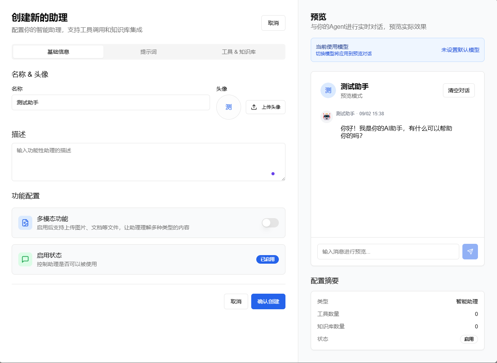
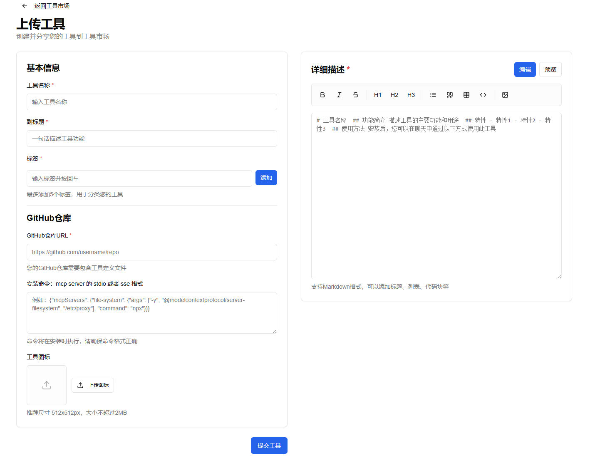

# AgentX - 智能对话系统平台


AgentX 是一个基于大模型 (LLM) 和多能力平台 (MCP) 的智能 Agent 构建平台。它致力于简化 Agent 的创建流程，让用户无需复杂的流程节点或拖拽操作，仅通过自然语言和工具集成即可打造个性化的智能 Agent。

## 🚀 功能介绍

### 🤖 Agent 创建与管理

AgentX 提供了直观易用的 Agent 创建界面，让您能够快速构建个性化的智能助手。

#### 📝 Agent 创建流程

1. **登录系统**
   - 访问 http://localhost:3000
   - 使用管理员账号登录：`admin@agentx.ai` / `admin123`

2. **创建新 Agent**
   - 点击"创建 Agent"按钮
   - 填写 Agent 基本信息：
     - 名称：为您的 Agent 起一个有意义的名字
     - 描述：详细描述 Agent 的功能和用途
     - 头像：上传或选择 Agent 的头像

3. **配置 Agent 能力**
   - 选择大模型：支持多种 LLM 服务商
   - 设置上下文管理：配置对话历史长度和摘要策略
   - 添加工具：从工具市场选择所需的功能工具
   - 配置 MCP 策略：设置 Agent 的行为模式

4. **发布与测试**
   - 保存配置并发布 Agent
   - 在测试环境中验证 Agent 功能
   - 调整参数优化性能



#### 🔧 Agent 管理功能

- **版本管理**：支持 Agent 的版本控制和回滚
- **性能监控**：实时监控 Agent 的使用情况和响应时间
- **用户反馈**：收集用户使用反馈，持续优化 Agent
- **A/B 测试**：支持不同版本的 Agent 进行对比测试


#### 📊 管理工具特色

- **可视化仪表板**：直观展示系统运行状态
- **实时监控**：24/7 系统状态监控
- **智能告警**：异常情况自动通知
- **批量操作**：支持批量用户和内容管理
- **权限分级**：细粒度的权限控制

### 🛠️ 工具创建与管理

AgentX 提供了强大的工具创建和管理功能，让您能够构建和集成各种功能工具。

#### 🔧 工具创建流程

1. **工具设计**
   - 定义工具名称和功能描述
   - 设置工具类型和分类
   - 配置工具图标和标签

2. **功能实现**
   - 编写工具逻辑代码
   - 定义输入输出参数
   - 设置错误处理和验证

3. **测试验证**
   - 单元测试和集成测试
   - 性能测试和压力测试
   - 安全测试和权限验证

4. **发布部署**
   - 工具审核和发布
   - 版本管理和更新
   - 使用统计和反馈收集



#### 🎯 工具管理特色

- **可视化编辑器**：拖拽式工具构建界面
- **模板库**：丰富的工具模板和示例
- **版本控制**：支持工具的版本管理和回滚
- **权限管理**：细粒度的工具访问权限控制
- **性能监控**：实时监控工具的使用性能

### 📚 知识库搭建

AgentX 的知识库系统让您能够构建专业的知识体系，为 Agent 提供强大的知识支持。

#### 🏗️ 知识库构建流程

1. **知识收集**
   - 文档上传和导入
   - 网页内容抓取
   - 数据库连接和同步
   - 实时数据流接入

2. **知识处理**
   - 智能文档解析
   - 内容分块和向量化
   - 关键词提取和标签
   - 知识图谱构建

3. **知识组织**
   - 分类体系和标签管理
   - 知识关联和推理
   - 多语言支持
   - 知识更新和维护

4. **智能检索**
   - 语义搜索和相似度匹配
   - 多模态检索支持
   - 个性化推荐
   - 实时知识问答


#### 🧠 知识库核心特性

- **多格式支持**：PDF、Word、Excel、PPT、HTML等
- **智能解析**：自动识别文档结构和内容
- **向量检索**：基于语义的智能搜索
- **知识图谱**：构建知识间的关联关系
- **实时更新**：支持知识的动态更新和同步

### 🛠️ 核心功能特性

- **🔧 Agent 管理**：创建、编辑、发布、监控智能 Agent
- **🧠 LLM 集成**：支持多种大语言模型服务商
- **🔌 MCP 支持**：多能力平台集成，扩展 Agent 功能
- **📚 RAG 系统**：知识检索增强生成
- **💰 计费系统**：灵活的计费策略和支付集成
- **📈 监控分析**：全面的使用统计和性能分析
- **🌐 API 开放**：提供完整的 RESTful API
- **🔒 安全防护**：多层次的安全保障机制
- **🛠️ 工具开发**：可视化工具创建和集成平台
- **📚 知识管理**：智能知识库构建和检索系统
- **🔗 工作流编排**：灵活的任务流程设计和执行


## 🚀 快速开始

### 🐳 一键部署（推荐）

适用于想要快速体验完整功能的用户，**无需下载源码**，一个命令启动所有服务：

#### 步骤1：准备配置文件

```bash
# 下载配置文件模板
curl -O https://raw.githubusercontent.com/Mantraa-Zzz/AgentX/main/.env.example
# 复制并编辑配置
cp .env.example .env
# 根据需要修改 .env 文件中的配置
```

#### 步骤2：启动服务

```bash
# 一键启动（包含前端+后端+数据库+消息队列）
# 🎯 智能适配：本地、内网、服务器环境均可使用相同命令
docker run -d \
  --name agentx \
  -p 3000:3000 \
  -p 8088:8088 \
  -p 5432:5432 \
  -p 5672:5672 \
  -p 15672:15672 \
  --env-file .env \
  -v agentx-data:/var/lib/postgresql/data \
  -v agentx-storage:/app/storage \
  ghcr.nju.edu.cn/lucky-aeon/agentx:latest
```

> 🚀 **智能部署**：无需区分本地或服务器环境，前端自动检测当前访问IP并连接对应的后端服务

#### 访问服务

| 服务 | 地址 | 说明 |
|------|------|------|
| **主应用** | http://localhost:3000 | 前端界面 |
| **后端API** | http://localhost:8088 | API服务 |
| **数据库** | http://localhost:5432 | PostgreSQL（可选） |
| **RabbitMQ** | http://localhost:5672 | 消息队列（可选） |
| **RabbitMQ管理** | http://localhost:15672 | 队列管理界面（可选） |

#### 高可用网关（可选）

如需API高可用功能，可额外部署：

```bash
docker run -d \
  --name agentx-gateway \
  -p 8081:8081 \
  ghcr.io/lucky-aeon/api-premium-gateway:latest
```

**默认登录账号**：
- 管理员：`admin@agentx.ai` / `admin123`
- 测试用户：`test@agentx.ai` / `test123`

### 🎯 快速开始使用

#### 第一步：登录系统
1. 打开浏览器访问：http://localhost:3000
2. 使用管理员账号登录：`admin@agentx.ai` / `admin123`

#### 第二步：创建您的第一个 Agent
1. 点击"创建 Agent"按钮
2. 填写 Agent 基本信息（名称、描述、头像）
3. 选择合适的大语言模型
4. 配置 Agent 的能力和工具
5. 保存并发布 Agent

#### 第三步：测试和使用
1. 在 Agent 列表中查看您创建的 Agent
2. 点击"测试"按钮进行功能验证
3. 根据测试结果调整 Agent 配置
4. 发布正式版本供用户使用

#### 第四步：管理监控
1. 使用管理员界面监控系统状态
2. 查看用户使用情况和统计数据
3. 根据数据优化 Agent 性能
4. 管理用户权限和内容审核

#### 第五步：创建自定义工具
1. 进入工具创建界面
2. 设计工具功能和参数
3. 编写工具逻辑代码
4. 测试和发布工具

#### 第六步：搭建知识库
1. 创建新的知识库项目
2. 上传和导入知识文档
3. 配置知识处理参数
4. 训练和优化知识检索

#### 🌐 部署场景示例

**本地开发**：
```bash
# 访问: http://localhost:3000
# API自动指向: http://localhost:8088/api ✅
```

**内网服务器**：
```bash
# 访问: http://192.168.1.100:3000
# API自动指向: http://192.168.1.100:8088/api ✅
```

**公网服务器**：
```bash
# 访问: http://your-server-ip:3000
# API自动指向: http://your-server-ip:8088/api ✅

# 访问: http://your-domain.com:3000
# API自动指向: http://your-domain.com:8088/api ✅
```

> 💡 **提示**：生产环境部署前，请在.env文件中修改默认密码和JWT密钥

### 👨‍💻 开发环境部署
适用于需要修改代码或定制功能的开发者：

```bash
# 1. 克隆项目
git clone https://github.com/Mantraa-Zzz/AgentX.git
cd AgentX/deploy

# 2. 启动开发环境（Linux/macOS）
./start.sh

# 2. 启动开发环境（Windows）
start.bat
```

**开发环境特色**：
- 🔥 代码热重载
- 🛠 数据库管理工具
- 🐛 调试端口开放
- 📊 详细开发日志

## ⏳ 功能
 - [x] Agent 管理（创建/发布）
 - [x] LLM 上下文管理（滑动窗口，摘要算法）
 - [x] Agent 策略（MCP）
 - [x] 大模型服务商
 - [x] 用户
 - [x] 工具市场
 - [x] MCP Server Community
 - [x] MCP Gateway 
 - [x] 预先设置工具
 - [x] Agent 定时任务
 - [x] Agent OpenAPI
 - [x] 模型高可用组件
 - [x] RAG
 - [x] 计费
 - [x] Agent 监控
 - [x] 嵌入网站组件
 - [ ] Multi Agent
 - [ ] 知识图谱
 - [ ] 长期记忆 
 
## ⚙️ 环境变量配置

AgentX使用`.env`配置文件进行环境变量管理，支持丰富的自定义配置：

### 📁 配置文件说明

| 配置项 | 说明 | 默认值 |
|--------|------|-------|
| **基础服务** |  |  |
| `SERVER_PORT` | 后端API端口 | `8088` |
| `DB_PASSWORD` | 数据库密码 | `agentx_pass` |
| `RABBITMQ_PASSWORD` | 消息队列密码 | `guest` |
| **安全配置** |  |  |
| `JWT_SECRET` | JWT密钥（必须修改） | 需要设置 |
| `AGENTX_ADMIN_PASSWORD` | 管理员密码 | `admin123` |
| **外部服务** |  |  |
| `EXTERNAL_DB_HOST` | 外部数据库地址 | 空（使用内置） |
| `EXTERNAL_RABBITMQ_HOST` | 外部消息队列地址 | 空（使用内置） |

### 🔧 快速配置

```bash
# 1. 获取配置模板
curl -O https://raw.githubusercontent.com/Mantraa-Zzz/AgentX/main/.env.example

# 2. 创建配置文件
cp .env.example .env

# 3. 编辑配置（必改项）
vim .env
```

**必须修改的配置项**：
- `JWT_SECRET`: 设置安全的JWT密钥（至少32字符）
- `AGENTX_ADMIN_PASSWORD`: 修改管理员密码
- `DB_PASSWORD`: 修改数据库密码

### 📝 配置分类

<details>
<summary><strong>🔐 安全配置（重要）</strong></summary>

```env
# 生产环境必须修改
JWT_SECRET=your_secure_jwt_secret_key_at_least_32_characters
AGENTX_ADMIN_PASSWORD=your_secure_admin_password
DB_PASSWORD=your_secure_db_password
RABBITMQ_PASSWORD=your_secure_mq_password
```

</details>

<details>
<summary><strong>🔗 外部服务集成</strong></summary>

```env
# 使用外部数据库
EXTERNAL_DB_HOST=your-postgres-host
DB_HOST=your-postgres-host
DB_USER=your-db-user
DB_PASSWORD=your-db-password

# 使用外部消息队列
EXTERNAL_RABBITMQ_HOST=your-rabbitmq-host
RABBITMQ_HOST=your-rabbitmq-host
RABBITMQ_USERNAME=your-mq-user
RABBITMQ_PASSWORD=your-mq-password
```

</details>

<details>
<summary><strong>☁️ 云服务配置</strong></summary>

```env
# 阿里云OSS
OSS_ENDPOINT=https://oss-cn-beijing.aliyuncs.com
OSS_ACCESS_KEY=your_access_key
OSS_SECRET_KEY=your_secret_key
OSS_BUCKET=your_bucket_name

# AWS S3
S3_SECRET_ID=your_s3_access_key
S3_SECRET_KEY=your_s3_secret_key
S3_REGION=us-east-1
S3_BUCKET_NAME=your_bucket

# AI服务
SILICONFLOW_API_KEY=your_api_key
HIGH_AVAILABILITY_ENABLED=true
HIGH_AVAILABILITY_GATEWAY_URL=http://localhost:8081
```

</details>

<details>
<summary><strong>📧 通知与认证</strong></summary>

```env
# 邮件服务
MAIL_SMTP_HOST=smtp.qq.com
MAIL_SMTP_USERNAME=your_email@qq.com
MAIL_SMTP_PASSWORD=your_email_password

# GitHub OAuth
GITHUB_CLIENT_ID=your_github_client_id
GITHUB_CLIENT_SECRET=your_github_client_secret

# 支付服务
ALIPAY_APP_ID=your_alipay_app_id
STRIPE_SECRET_KEY=your_stripe_secret_key
```

</details>

> 📋 **完整配置参考**：查看 [.env.example](/.env.example) 文件了解所有可配置参数


## 📖 部署文档

| 文档 | 说明 |
|------|------|
| [生产部署指南](docs/deployment/PRODUCTION_DEPLOY.md) | 生产环境完整部署 |
| [开发部署指南](deploy/README.md) | 开发者环境配置 |
| [故障排查手册](docs/deployment/TROUBLESHOOTING.md) | 问题诊断和解决 |


